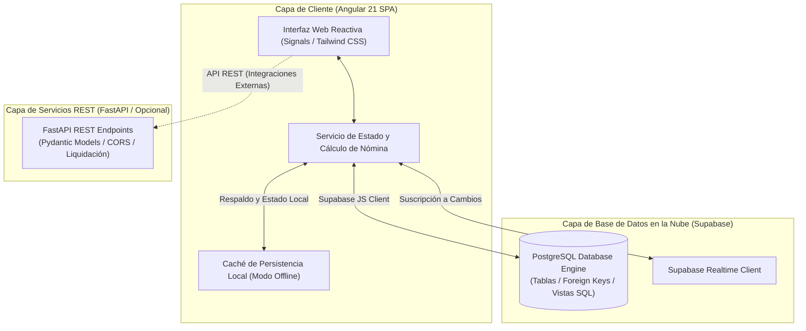

# BoyaControl
### *Sistema de Gestión de Operaciones Madereras, Embarques de Balsa y Liquidación de Cuadrillas*

[](https://angular.dev/)
[](https://www.typescriptlang.org/)
[](https://tailwindcss.com/)
[](https://supabase.com/)
[](https://fastapi.tiangolo.com/)
[](https://vitest.dev/)
[](https://vercel.com/)

---

## Tabla de Contenidos
1. [Resumen Ejecutivo](#resumen-ejecutivo)
2. [Arquitectura del Sistema](#arquitectura-del-sistema)
3. [Lógica de Negocio y Modelos Matemáticos de Liquidación](#lógica-de-negocio-y-modelos-matemáticos-de-liquidación)
4. [Módulos Funcionales](#módulos-funcionales)
5. [Modelo de Datos y Esquema Relacional](#modelo-de-datos-y-esquema-relacional)
6. [Modos de Operación: Offline vs Cloud](#modos-de-operación-offline-vs-cloud)
7. [Stack Tecnológico](#stack-tecnológico)
8. [Estructura del Repositorio](#estructura-del-repositorio)
9. [Guía de Instalación y Despliegue](#guía-de-instalación-y-despliegue)
10. [Aseguramiento de Calidad (QA)](#aseguramiento-de-calidad-qa)
11. [Licencia y Derechos](#licencia-y-derechos)

---

## Resumen Ejecutivo

**BoyaControl** es una plataforma tecnológica empresarial orientada a la digitalización, control logístico y administración de nómina para aserraderos, centros de acopio y procesadoras de **madera de boya (balsa)**.

Tradicionalmente, las operaciones en patios madereros se gestionan mediante libretas físicas manuscritas, propensas a extravío, inconsistencias en el cálculo de jornales y falta de visibilidad en cuentas por pagar a estibadores y cargadores.

BoyaControl automatiza integralmente este ciclo operativo:
* **Digitalización Inmediata en Patio:** Registro veloz de entradas de camiones con trozas de balsa y despacho de tráilers con bloques procesados.
* **Cálculo Matemático Automatizado de Jornales:** Reparto algorítmico exacto de tarifas por fila y por unidad de transporte entre los miembros de la cuadrilla participante.
* **Trazabilidad de Cuentas por Pagar:** Monitoreo individualizado del estado de pago de cada trabajador (Pendiente vs. Pagado) con registro de fecha de cobro.
* **Liquidaciones y Reportes Financieros Formales:** Generación de recibos de pago con desglose detallado y espacio para firma de conformidad, listos para exportación en formato de impresión y hojas de cálculo (CSV/Excel).

---

## Arquitectura del Sistema

La solución está construida sobre una arquitectura modular desacoplada con capacidades de persistencia dual (almacenamiento local para resiliencia en zonas sin cobertura e integración en la nube con Supabase):



### Principios Arquitectónicos
1. **Resiliencia Operativa en Campo:** El sistema opera sin interrupciones aun cuando la conexión a internet en aserraderos o patios remotos falle, sincronizando con la base de datos central en cuanto se restablece la conectividad.
2. **Reactividad Basada en Signals:** Angular Signals garantiza reactividad granular en pantalla sin re-renderizados costosos al actualizar montos, trabajadores o estados de pago.
3. **Inmutabilidad y Auditoría Financiera:** Cada transacción de descarga o embarque registra marcas de tiempo UTC atómicas y desglose por trabajador para auditorías contables.

---

## Lógica de Negocio y Modelos Matemáticos de Liquidación

El sistema parametriza las fórmulas del sector maderero para garantizar exactitud en la remuneración de las cuadrillas:

### 1. Bajada y Descarga de Madera (Camiones y Carros de Trozas)
Las descargas se valoran en función de la cantidad de carros de madera y las filas contenidas por vehículo, a una tarifa estándar parametrizada por fila (por defecto $5.00 USD).

El costo total de la descarga se calcula como:

$$\text{Total Descarga} = \text{Cantidad de Carros} \times \text{Filas por Carro} \times \text{Tarifa por Fila}$$

La distribución individual para cada trabajador asignado a la cuadrilla es equitativa:

$$\text{Pago Individual} = \frac{\text{Total Descarga}}{\text{Número de Trabajadores Participantes}}$$

### 2. Embarque y Estiba de Tráilers (Bloques de Boya Procesada)
La carga de tráilers con bloques de exportación se liquida a una tarifa fija por persona por cada unidad de transporte completada (por defecto $7.00 USD por persona por tráiler):

$$\text{Pago Individual Embarque} = \text{Cantidad de Tráilers} \times \text{Tarifa Fija por Persona}$$

$$\text{Costo Total del Embarque} = \text{Pago Individual Embarque} \times \text{Número de Trabajadores Participantes}$$

### 3. Estado de Liquidación
Cada asignación de trabajo a un operario mantiene un estado booleano independiente (`pagado`), permitiendo abonos parciales, pagos anticipados por trabajador o liquidaciones colectivas al cierre de jornada.

---

## Módulos Funcionales

| Módulo | Descripción Funcional |
| :--- | :--- |
| **Control de Descarga de Madera** | Registro de camiones entrantes con madera en troza. Selección de fecha, cantidad de carros, número de filas y tarifa por fila. Asignación dinámica de cuadrilla participante con cálculo automático instantáneo de la cuota individual. Control de cobro por trabajador (Pagado / Pendiente). |
| **Control de Embarque de Tráilers** | Registro de despachos de producto terminado hacia plantas procesadoras o puertos. Selección de fecha, número de tráilers y tarifa acordada. Selección de estibadores y control granular del pago por cada operario. |
| **Directorio de Personal y Cuadrillas** | Administración de trabajadores: nombres completos, alias de patio (ej. apodos comúnmente utilizados en faena maderera), número telefónico y estado de disponibilidad laboral. Visualización del balance acumulado pendiente de cobro por cada operario. |
| **Reportes y Liquidación de Nómina** | Centro analítico con filtros por rango de fechas, trabajador específico y estado de pago. Cálculo de balance neto adeudado, exportación a hojas de cálculo (CSV) y vista formal de liquidación lista para impresión física o PDF con casillas de firma de recibido conforme. |

---

## Modelo de Datos y Esquema Relacional

El esquema relacional implementado en Supabase (PostgreSQL) garantiza normalización en tercera forma normal (3NF) y consistencia mediante restricciones de clave foránea:

```
+-------------------+       +---------------------------+       +------------------------+
|    trabajadores   |       |    descargas_madera       |       |   embarques_trailer    |
+-------------------+       +---------------------------+       +------------------------+
| id (UUID, PK)     |       | id (UUID, PK)             |       | id (UUID, PK)          |
| nombre (TEXT)     |       | fecha (DATE)              |       | fecha (DATE)           |
| alias (TEXT)      |       | cantidad_carros (INT)     |       | cantidad_trailers (INT)|
| telefono (TEXT)   |       | filas_por_carro (INT)     |       | tarifa_persona (NUM)   |
| activo (BOOLEAN)  |       | tarifa_por_fila (NUM)     |       | total_pago (NUM)       |
| created_at (TZ)   |       | total_pago (NUM)          |       | observaciones (TEXT)   |
+---------+---------+       +-------------+-------------+       +-----------+------------+
          |                               |                                 |
          |         +---------------------+---------+                       |
          +-------->|      descarga_trabajadores    |                       |
          |         +-------------------------------+                       |
          |         | id (UUID, PK)                 |                       |
          |         | descarga_id (FK -> descargas) |                       |
          |         | trabajador_id (FK -> trabaj.) |                       |
          |         | monto_individual (NUMERIC)    |                       |
          |         | pagado (BOOLEAN)              |                       |
          |         | fecha_pago (TIMESTAMPTZ)      |                       |
          |         +-------------------------------+                       |
          |                                                                 |
          |         +-------------------------------+                       |
          +-------->|      embarque_trabajadores    |<----------------------+
                    +-------------------------------+
                    | id (UUID, PK)                 |
                    | embarque_id (FK -> embarques) |
                    | trabajador_id (FK -> trabaj.) |
                    | monto_individual (NUMERIC)    |
                    | pagado (BOOLEAN)              |
                    | fecha_pago (TIMESTAMPTZ)      |
                    +-------------------------------+
```

---

## Modos de Operación: Offline vs Cloud

### Modo Local / Demostración Automática
Para asegurar que la plataforma pueda ejecutarse de forma inmediata en cualquier dispositivo sin requisitos de infraestructura previa:
* Incorpora un repositorio local reactivo precargado con datos de producción correspondientes a semanas de faena en patio.
* Permite crear, modificar y liquidar descargas y embarques guardando el estado en almacenamiento local persistente del navegador.

### Modo Nube / Supabase Realtime
Al configurar las variables de entorno de Supabase:
* Las transacciones se sincronizan directamente con PostgreSQL bajo esquemas relacionales.
* Se habilitan políticas de seguridad por fila (Row Level Security - RLS).
* Múltiples dispositivos en el patio maderero y en la oficina administrativa pueden consultar la información en tiempo real sin desfases.

---

## Stack Tecnológico

### Frontend
* **Framework:** Angular 21.1.0 (Componentes Standalone, Signals, Control Flow nativo `@if` / `@for`)
* **Lenguaje:** TypeScript 5.9
* **Diseño y Estilos:** Tailwind CSS v4.3.3 con PostCSS y Autoprefixer
* **Iconografía:** Material Icons / Tipografía de alta legibilidad
* **Pruebas Unitarias:** Vitest 4.0.8 y JSDOM

### Persistencia y Nube
* **Motor de Base de Datos:** PostgreSQL en Supabase
* **Cliente de Base de Datos:** `@supabase/supabase-js` v2.116.0
* **Hosting y Despliegue:** Vercel (Configuración SPA con `vercel.json`)

### Backend Auxiliar (API Microservicio)
* **Framework:** FastAPI (Python 3.11+)
* **Validación de Datos:** Pydantic Models
* **Seguridad Web:** Middleware CORS de alta compatibilidad

---

## Estructura del Repositorio

```
Proyecto-De-Boya/
├── backend/                        # Microservicio opcional en FastAPI
│   ├── main.py                     # Definición de modelos Pydantic y endpoints REST
│   └── requirements.txt            # Dependencias del servicio Python
├── public/                         # Recursos públicos estáticos
├── src/                            # Código fuente de la aplicación cliente Angular
│   ├── app/                        # Componentes, servicios y modelos de datos
│   │   ├── components/             # Vistas de Descargas, Embarques, Personal y Nómina
│   │   ├── services/               # Servicios de sincronización (Supabase / LocalStorage)
│   │   └── models/                 # Interfaces de TypeScript y contratos de datos
│   ├── environments/               # Variables de entorno y llaves públicas de Supabase
│   │   ├── environment.ts          # Configuración de desarrollo
│   │   └── environment.prod.ts     # Configuración de producción
│   ├── index.html                  # Plantilla HTML base
│   ├── main.ts                     # Punto de entrada de la aplicación Angular
│   └── styles.css                  # Definición de utilidades Tailwind CSS
├── supabase/                       # Scripts de base de datos
│   └── schema.sql                  # Definición de DDL, tablas, claves foráneas y vistas
├── .editorconfig                   # Estandarización de formato de código
├── .gitignore                      # Reglas de exclusión para control de versiones
├── angular.json                    # Configuración del compilador y assets de Angular CLI
├── package.json                    # Manifiesto de dependencias NPM
├── tsconfig.json                   # Configuración del compilador TypeScript
├── vercel.json                     # Reglas de enrutamiento y reescritura para Vercel
└── README.md                       # Documentación principal de la plataforma
```

---

## Guía de Instalación y Despliegue

### Requisitos Previos
* **Node.js:** Versión 20.x o superior
* **NPM:** Versión 10.x o superior
* **Git:** Para control de versiones

---

### Ejecución Local

1. Clonar el repositorio e ingresar a la carpeta del proyecto:
```bash
git clone https://github.com/JeremyJaramillo72/Proyecto-De-Boya.git
cd Proyecto-De-Boya
```

2. Instalar las dependencias del proyecto:
```bash
npm install
```

3. Iniciar el servidor de desarrollo local:
```bash
npm start
```
*La aplicación estará disponible de inmediato en `http://localhost:4200` en modo local/demostración.*

---

### Configuración con Supabase (Nube)

1. Crear un nuevo proyecto en [Supabase](https://supabase.com).
2. Abrir la sección **SQL Editor** en el panel de Supabase.
3. Copiar el contenido de [`supabase/schema.sql`](supabase/schema.sql), pegarlo en el editor y ejecutar la consulta.
4. Obtener las credenciales en **Project Settings -> API**:
   * **Project URL**
   * **Project API Key (anon public)**
5. Actualizar el archivo `src/environments/environment.ts`:
```typescript
export const environment = {
  production: false,
  supabaseUrl: 'https://tu-proyecto.supabase.co',
  supabaseAnonKey: 'tu-clave-anon-publica'
};
```
*Al recargar, la aplicación sincronizará automáticamente contra la base de datos PostgreSQL.*

---

### Despliegue en Producción (Vercel)

El repositorio incluye el archivo de configuración `vercel.json` preparado para enrutamiento SPA sin errores de recarga (HTTP 404):

1. Conectar el repositorio de GitHub con la cuenta de Vercel.
2. Seleccionar el Framework Preset: **Angular**.
3. Definir las variables de entorno de producción si se utiliza Supabase (`SUPABASE_URL`, `SUPABASE_KEY`).
4. Proceder con el despliegue automático.

---

## Aseguramiento de Calidad (QA)

El código se encuentra protegido por herramientas de validación estática y pruebas unitarias:

```bash
# Verificación estricta de compilación y tipado TypeScript
npx tsc --noEmit

# Ejecución de la suite de pruebas unitarias con Vitest
npm test

# Compilación de producción optimizada
npm run build
```

---

## Licencia y Derechos

(C) 2026 **BoyaControl**. Todos los derechos reservados.  
Plataforma desarrollada para el control logístico, operativo y financiero en la industria maderera de balsa. Queda prohibida su reproducción o distribución sin autorización expresa.
